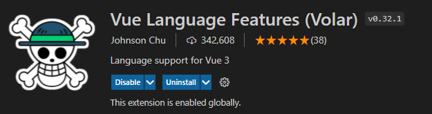
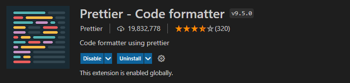
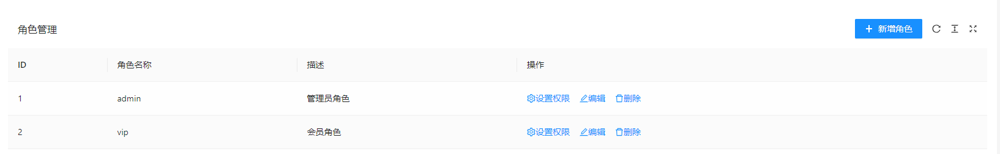
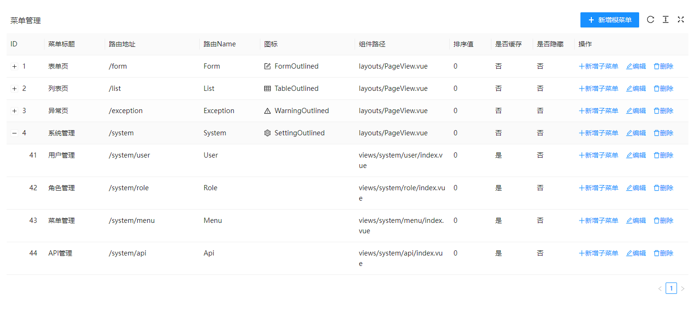
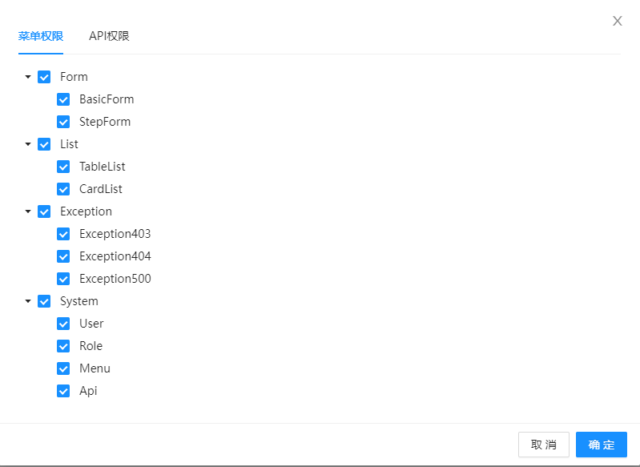
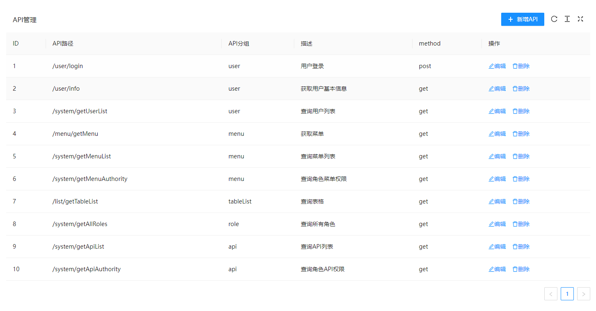
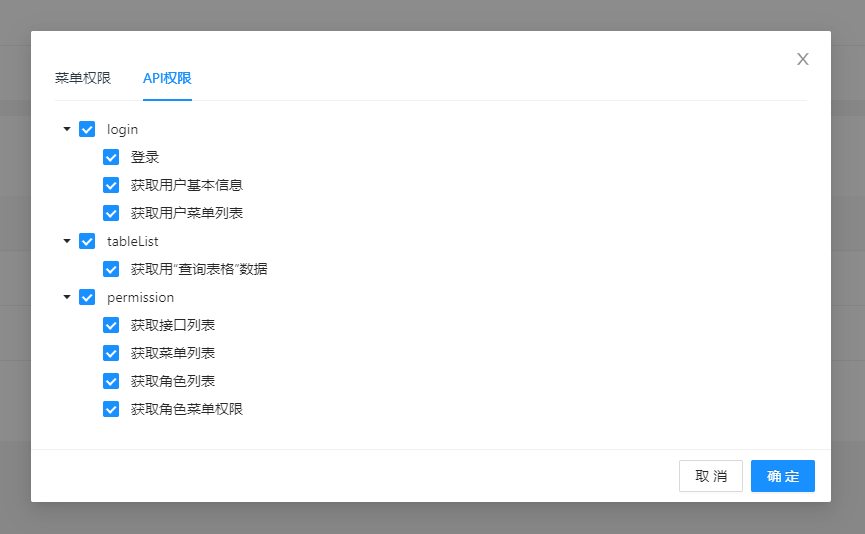

# Vite+Vue3+TS 项目配置

## 创建 Vite 项目

首先，通过模板创建项目：

```sh
yarn create vite project-name
# 或 npm create vite@latest project-name
```

选择 vue 框架以及 vue-ts 的版本。

接着安装依赖：

```sh
yarn
# 或 npm install
```

然后运行项目：

```sh
yarn dev
# 或 npm run dev
```


## Volar 语法提示插件

推荐在 VS Code 中安装 Volar 扩展，Volar 为 Vue3 和 TS 提供了更加友好的语法提示。



> 安装 Volar 需要先关闭 Vetur 并重启 IDE。


## Prettier

### VS Code 安装扩展

VS Code 搜索并安装 Prettier 扩展：



修改 `settings.json` 配置文件：

```json
{
  "editor.defaultFormatter": "esbenp.prettier-vscode", // 设为默认格式化插件
  "editor.formatOnSave": true // 保存文件时自动格式化代码
}
```

> 如果 VS Code 对某些文件启用了其他特定的格式化插件，需要取消对应的配置，或者手动改为 `"esbenp.prettier-vscode"` 。

```diff
  {
-   "[vue]": {
-     "editor.defaultFormatter": "johnsoncodehk.volar"
-   }
  }
```

然后配置 Prettier 规则：可以打开 `Preferences -> Settings` ，搜索 prettier 进行配置，或者参考 [Prettier 配置](https://www.prettier.cn/docs/options.html#prose-wrap) ，修改 `settings.json` ：

```json
{
  "prettier.semi": false,
  "prettier.singleQuote": true,
  "prettier.trailingComma": "none"
}
```


### 项目配置

团队开发中，为了对项目代码进行统一格式化，需要在项目中另外引入 Prettier ：

```sh
yarn add prettier -D
```

创建 `.prettierignore` ，配置忽略代码格式化的目录和文件：

```
/dist/*
.local
.output.js
/node_modules/**

**/*.svg
**/*.sh

/public/*
```

创建 `prettier.config.js`：

```js
module.exports = {
  printWidth: 100,
  semi: true,
  singleQuote: true,
  trailingComma: 'all',
  proseWrap: 'never',
  htmlWhitespaceSensitivity: 'strict',
  endOfLine: 'auto',
};
```

Prettier 格式化代码时，如果发现项目根目录有配置文件，则会优先使用配置文件的规则，这样就可以对代码统一格式化。


## 类型声明文件

新建 `types` 文件夹，用于统一存放项目中的类型声明文件，我们把默认生成的 `src/env.d.ts` 文件也放到这个文件夹中统一管理。然后修改 `tsconfig.json` ，增加 TS 编译目录和类型声明目录：

```diff
  {
    "include": [
      "src/**/*.ts",
      "src/**/*.d.ts",
      "src/**/*.tsx",
      "src/**/*.vue",
+     "types/**/*.ts"
+     "types/**/*.d.ts"
    ]
  }
```


## 配置开发服务器

```typescript
import { defineConfig } from 'vite';
import vue from '@vitejs/plugin-vue';

// https://vitejs.dev/config/
export default defineConfig({
  // ...
  server: {
    host: true,
    port: 3000
  }
});
```

- `host` 指定监听 IP 地址，这样就可以通过局域网打开项目。
- `port` 指定本地服务器的端口，当端口被占用时，Vite 会监听下一个可用的端口。 


## setup 语法糖自动导入 API

如果项目使用 `setup` 语法糖，则可以通过 `unplugin-auto-import` 插件自动化导入相关的 API。

安装插件：

```sh
yarn add unplugin-auto-import -D
# 或 npm install unplugin-auto-import -D
```

修改 `vite.config.js` 配置文件：

```diff
  import { defineConfig } from 'vite';
  import vue from '@vitejs/plugin-vue';
+ import AutoImport from 'unplugin-auto-import/vite';

  export default defineConfig({
    plugins: [
      vue(),
+     AutoImport({
+       imports: ['vue'],
+       dts: 'types/auto-imports.d.ts',
+     }),
+   ],
  });
```

```diff
  <script setup lang="ts">
- import { ref } = 'vue'; // 不再需要手动导入相关的 API
  const count = ref(0);
  </script>
```


## 配置路径别名

首先需要安装 `@types/node` 来识别 node 模块：

```sh
yarn add @types/node -D
```

然后修改 `vite.config.js`：

```diff
  import { defineConfig } from 'vite';
+ import * as path from 'path';

  export default defineConfig({
+   resolve: {
+     alias: {
+       '@': path.resolve(__dirname, 'src'),
+     },
+   },
  });
```

还需要修改 `tsconfig.json` ，为 TS 设置模块名-路径映射，否则以别名开头的模块无法被 TS 识别：

```json
{
  "compilerOptions": {
    "paths": {
      "@/*": ["./src/*"]
    }
  }
}
```

除此之外，建议 VS Code 安装 Path Autocomplete 这个扩展，可以添加路径提示，同时可以修改 `settings.json` ，为路径别名添加路径提示：

```json
{
  "path-autocomplete.pathMappings": {
    "@": "${folder}/src/"
  }
}
```


## CSS 预处理器

Vite 内置了对 `.scss`, `.sass`, `.less`, `.styl` 和 `.stylus` 文件的支持，只需要安装预处理依赖：

```sh
yarn add less -D
```


## Ant Design Vue 组件库

Ant Design Vue 的用法参考：[Ant Design Vue 官方文档](https://2x.antdv.com/docs/vue/introduce-cn)

首先安装组件库：

```sh
yarn add ant-design-vue
```

为了实现按需导入，需要安装 `unplugin-vue-components` 插件：

```sh
yarn add unplugin-vue-components -D
```

然后修改 `vite.config.js` ：

```diff
  import { defineConfig } from 'vite';
+ import Components from 'unplugin-vue-components/vite';
+ import { AntDesignVueResolver } from 'unplugin-vue-components/resolvers';

  export default defineConfig({
    plugins: [
+     Components({
+       resolvers: [AntDesignVueResolver()],
+     }),
    ],
  });
```


## Vue Router

首先安装 `vue-router`：

```sh
yarn add vue-router
```

然后定义路由表：

```typescript
// src/router/index.ts
import { createRouter, createWebHistory, RouteRecordRaw } from 'vue-router';
import Home from '@/components/Home.vue';

const routes: RouteRecordRaw[] = [
  {
    path: '/',
    component: Home
  },
];

const router = createRouter({
  history: createWebHistory(),
  routes,
});

export default router;
```

使用 `<router-view>` ：

```vue
<!-- src/App.vue -->
<template>
  <router-view></router-view>
</template>
```

引入路由：

```diff
  // src/main.ts
  import { createApp } from 'vue';
  import App from './App.vue';
+ import router from './router';

- createApp(App).mount('#app');
+ const app = createApp(App);

+ app.use(router).mount('#app');
```

NProgress 插件显示页面加载进度条：

```sh
yarn add nprogress
yarn add -D @types/nprogress
```

```diff
  // src/router/index.ts
  import { createRouter, createWebHistory, RouteRecordRaw } from 'vue-router';
  import Home from '@/components/Home.vue';
+ import NProgress from 'nprogress';
+ import 'nprogress/nprogress.css';

  const routes: RouteRecordRaw[] = [
    {
      path: '/',
      component: Home
    },
  ];

  const router = createRouter({
    history: createWebHistory(''),
    routes,
  });

+ router.beforeEach(() => {
+   NProgress.start();
+ });

+ router.afterEach(() => {
+   NProgress.done();
+ });

  export default router;
```


## 封装请求

### 安装

首先，安装 axios：

```sh
yarn add axios
```


### 基本封装

创建 `src/utils/http.ts` 文件，用于封装基本 axios：

```typescript
import axios, { AxiosInstance } from 'axios';

const http: AxiosInstance = axios.create({
  baseURL: 'http://localhost:3000', // 接口地址
  timeout: 10000,
});

export default http;
```


### 请求拦截和响应拦截

有些时候，我们需要对请求进行统一配置，例如：

- 请求拦截：在请求头中统一添加鉴权 `token` ，显示全局 loading 等。
- 响应拦截：对接口错误信息统一进行显示（Notification，Message 之类的组件），隐藏全局 loading 等。

我们先定义接口返回的数据格式：

```typescript
// types/http.d.ts
// 定义接口返回数据格式
declare interface HttpResponse<T = any> {
  code: number;
  data: T;
  message: string;
}
```

然后实现请求拦截和响应拦截：

```typescript
import axios, {
  AxiosInstance,
  AxiosRequestConfig,
  AxiosResponse,
} from 'axios';
import { notification } from 'ant-design-vue';
import 'ant-design-vue/es/notification/style/css';

const http: AxiosInstance = axios.create({
  baseURL: 'http://localhost:3000',
  timeout: 10000,
});

// 请求拦截
http.interceptors.request.use(
  (config: AxiosRequestConfig) => {
    return Promise.resolve(config);
  },
  (error: any) => {
    return Promise.reject(error);
  },
);

// 响应拦截（根据接口数据格式进行调整）
http.interceptors.response.use(
  <T = any>(response: AxiosResponse): Promise<T> => {
    const { code, data, message }: HttpResponse = response.data;
    if (code === 0) {
      // 请求成功
      return data;
    }
    // 请求异常
    notification.error({
      message: code,
      description: message,
    });
    return Promise.reject(message);
  },
  // 请求失败
  (error: any) => {
    if (error.response) {
      const { data } = error.response;
      notification.error({
        message: '请求失败',
        description: data.message || error.message,
      });
    }
    return Promise.reject(error);
  },
);

export default http;
```


### 封装 GET 请求和 POST 请求

为了实现请求方法的扁平化，我们进一步封装 GET 请求和 POST 请求（其他请求方式同理）：

```typescript
// 封装 GET 请求
export function get<T>(url: string, params = {}, config: AxiosRequestConfig = {}): Promise<T> {
  return http.get(url, {
    params,
    ...config,
  });
}

// 封装 POST 请求
export function post<T>(url: string, data = {}, config: AxiosRequestConfig = {}): Promise<T> {
  return http.post(url, data, config);
}
```

除此之外，上一步响应拦截中，请求会返回一个 `Promise` 对象，我们通过泛型 `<T>` 约束数据的类型。


### 封装 API

首先创建 `types/user.d.ts` ，用于定义数据类型：

```typescript
declare interface Token {
  token: string;
}
```

然后创建 `src/api/user.ts` ，封装用户模块相关的接口。

```typescript
import { post } from '@/utils/http';

// 登录
export const login = (account: Account) => post<Token>('/user/login', account);
```


### proxy 解决开发环境接口跨域问题

受浏览器同源策略的影响，浏览器不能跨域访问接口，而服务器不受此策略的影响，所以可以通过本地服务器代理请求，然后访问不同源的接口。

首先，我们需要创建 `.env.devlopment` 文件来声明开发环境变量：

```
# 开发环境接口地址（代理目标地址）
VITE_PROXY_TARGET_URL = http://localhost:3000
# 开发环境代理
VITE_PROXY_BASEURL = /api
```

然后，我们修改接口地址：

```diff
  const http: AxiosInstance = axios.create({
-   baseURL: 'http://localhost:3000',
+   baseURL: import.meta.env.VITE_PROXY_BASEURL,
    timeout: 10000,
  });
```

Vite 环境变量相关的内容参考：[Vite 环境变量和模式](https://cn.vitejs.dev/guide/env-and-mode.html) 。

接着，配置本地服务器代理，由于 `vite.config.ts` 中不能直接访问环境变量，所以我们需要基于一个函数进行配置以及通过 `loadEnv` 来加载环境变量（参考 [Vite 情境配置](https://cn.vitejs.dev/config/#conditional-config) 和 [Vite 环境变量](https://cn.vitejs.dev/config/#environment-variables)）：

```diff
  // vite.config.ts
- import { defineConfig } from 'vite';
+ import { ConfigEnv, defineConfig, loadEnv } from 'vite';
  // ...

  // https://vitejs.dev/config/
- export default defineConfig({
+ export default defineConfig(({ mode }: ConfigEnv) => {
+   const env = loadEnv(mode, process.cwd());

    return {
      // ...
      server: {
        host: true,
        port: 3000,
+       // 本地服务器代理，解决本地接口跨域问题
+       proxy: {
+         [env.VITE_PROXY_BASEURL]: {
+           target: env.VITE_PROXY_TARGET_URL,
+           changeOrigin: true,
+           rewrite: (path) => path.replace(new RegExp(`^${env.VITE_PROXY_BASEURL}`), ''),
          },
        },
      },
    };
  });
```

我们规定了本地接口以 `/api` 为请求前缀，代理的目标地址为 `http://localhost:3000` ，当本地测试环境发送请求时，就会被本地服务器代理。


## Mock

当后端接口数据还没完成时，前端可以通过 Mock 模拟接口数据，实现本地开发。


### 安装依赖

首先安装 Mock.js：

```sh
yarn add mockjs
```

然后安装 `vite-plugin-mock` ，该插件为 Vite 提供了本地 mocks 服务：

```sh
yarn add vite-plugin-mock -D
```


### 引入插件

```diff
  import { defineConfig } from 'vite';
+ import { viteMockServe } from 'vite-plugin-mock';

  export default defineConfig({
    plugins: [
      // ...
+     viteMockServe(),
    ],
  });
```

`vite-plugin-mock` 插件的详细配置参考：[Github: vite-plugin-mock](https://github.com/vbenjs/vite-plugin-mock)


### 添加 TS 编译目录

```diff
  {
    "include": [
      "src/**/*.ts",
      "src/**/*.d.ts",
      "src/**/*.tsx",
      "src/**/*.vue",
      "types/**/*.ts",
      "types/**/*.d.ts",
+     "mock/**/*.ts",
+     "mock/**/*.d.ts"
    ]
  }
```


### Mock 相关工具函数

对于 Mock 接口，我们创建 `mock/utils.ts` ，统一封装返回的数据格式：

```typescript
// 统一接口返回数据格式
export const successResult = <T>(data: T, code = 0, message = 'success') => {
  return {
    code,
    data,
    message,
  };
};

export const errorResult = (message = 'fail', data = null, code = -1) => {
  return {
    code,
    data,
    message,
  };
};
```


### 约束 Mock 请求参数

Mock 请求参数包含几个数据 `method`、`body`、`headers` 和 `query` ，我们对其进行约束：

```typescript
// types/http.d.ts
// 定义 Mock 请求参数
declare interface MockRequestParams {
  method: string;
  body: any;
  headers?: { authorization?: string };
  query: any;
}
```


### 添加 Mock 文件

我们创建 `mock/user.ts` 文件，对于不同模块的请求，建议分别创建单独的文件进行管理。

```typescript
import { MockMethod } from 'vite-plugin-mock';
import { Random } from 'mockjs';
import { successResult, errorResult } from './utils';

function getUserList() {
  return [
    {
      user_id: 1,
      username: 'admin',
      password: '123456',
      token: 'token1',
      avatar: Random.image('100x100', '#ccc', '#f00', 'a'),
    },
  ];
}

const userServices: MockMethod[] = [
  {
    url: '/user/login',
    timeout: 500,
    method: 'post',
    response: ({ body }: MockRequestParams) => {
      const { username, password } = body;
      const checkUser = getUserList().find(
        (user) => user.username === username && user.password === password,
      );
      if (!checkUser) {
        return resultError('帐号不存在或密码错误');
      }
      const { token } = checkUser;
      return successResult({
        token,
      });
    },
  },
];

export default userServices;
```

更多 Mock.js 的用法参考：[Mock.js 示例](http://mockjs.com/examples.html) 。


### 修改 baseURL

```diff
  // src/utils/http.ts
  const http: AxiosInstance = axios.create({
-   baseURL: import.meta.env.VITE_PROXY_BASEURL, // 接口
+   baseURL: '', // Mock
    timeout: 10000,
  });
```


## Pinia

[Pinia](https://pinia.vuejs.org/introduction.html) 是 Vue 官方团队开发的 Vue 状态管理的解决方案，Pinia 实现了 Vuex 5 的许多提案，是下一代的 Vuex。

Pinia 相比于 Vuex 3/4，具有以下特点：

- 去除了 `mutations` ，不再需要通过 `mutations` 这种冗长的方式修改状态。
- 更好地 TypeScript 支持。
- 无需手动添加 store，store 创建后会自动添加。
- 扁平化设计，无嵌套模块，也不需要命名空间，store 之间可以交叉组合使用。


### 安装

```sh
yarn add pinia
```


### 创建和挂载实例

```diff
  // src/main.ts
  import { createApp } from 'vue';
  import App from './App.vue';
  import router from './router';
+ import { createPinia } from 'pinia';

  const app = createApp(App);

- app.use(router).mount('#app');
+ app.use(router).use(createPinia()).mount('#app');
```


### 创建 store

```ts
// store/countStore.ts
import { defineStore } from 'pinia';

interface CountState {
  count: number;
}

export const useCountStore = defineStore('count', {
  state: (): CountState => {
    return {
      count: 0,
    };
  },
  actions: {
    increase(value: number) {
      this.count += value;
    },
  },
});
```

- `defineStore` 函数第一个参数表示 store 的名称，这个值需要唯一。
- `state` 和 Vue 2 组件中 `data` 选项的声明差不多，一个函数，返回一个对象，对象的属性就是响应式的数据。值得注意的是，`state` 采用箭头函数，这是为了保证服务端渲染也能正常使用。
- `actions` 和 Vue 2 组件中 `methods` 选项差不多，定义方法，方法内部通过 `this` 访问数据。


### 使用 store

```vue
<template>
  <!-- <div>{{ countStore.count }}</div> -->
  <div>{{ count }}</div>
  <button @click="onPlus">+1</button>
</template>

<script setup lang="ts">
  import { useCountStore } from '@/store/countStore';
  import { storeToRefs } from 'pinia';

  const countStore = useCountStore();
  const { count } = storeToRefs(countStore);

  const onPlus = () => {
    countStore.increase(1);
  };
</script>
```

和 Vue 3 中 `toRefs()` 方法类似，Pinia 提供了 `storeToRefs()` 方法，用于对 store 进行解构。状态值可以直接在组件中修改，但是建议通过 `actions` 封装方法，避免数据混乱，难以维护。


## 登录拦截

### 实现原理

1. 路由拦截，每次访问页面前，先检查本地是否有 token，如果没有，则跳转到登录页，执行第 2 步；如果有，执行第 3 步
2. 用户使用账号密码登录后，获取 token，将 token 缓存到本地
3. 所有（需要鉴权）的接口访问时，都要在请求头中携带 token
4. 携带 token 请求数据，如果返回 401 未授权，说明 token 过期，需要跳转到登录页，执行第 2 步


### 实现过程

1. 类型定义

类型定义，包含：

- `Account` ：登录帐号数据格式
- `Token` ：登录后获取到的数据格式
- `UserInfo` ：用户基本信息数据格式

```typescript
// types/login.ts
declare interface Account {
  username: string;
  password: string;
}

declare interface Token {
  token: string;
}

declare interface UserInfo {
  user_id: number;
  username: string;
  avatar: string;
}
```

2. 定义登录接口

```typescript
// src/api/user.ts
import { get, post } from '@/utils/http';

// 登录
export const login = (account: Account) => post<Token>('/user/login', account);

// 获取用户基本信息
export const getUserInfo = () => get<UserInfo>('/user/info');
```

3. 封装登录 store

```typescript
// src/store/loginStore.ts
import { defineStore } from 'pinia';
import { login, getUserInfo } from '@/api/user';

interface LoginState {
  userInfo: UserInfo | null; // 用户基本信息，用于判断是否登录
}

export const useLoginStore = defineStore('login', {
  state: (): LoginState => {
    return {
      userInfo: null,
    };
  },
  actions: {
    // 登录
    async login(account: Account) {
      try {
        const data = await login(account);
        // 本地缓存 token
        localStorage.setItem('token', data.token);
      } catch (error) {
        return Promise.reject(error);
      }
    },
    // 获取用户基本信息
    async getUserInfo() {
      try {
        const data = await getUserInfo();
        this.userInfo = data;
      } catch (error) {
        return Promise.reject(error);
      }
    },
    // 退出登录
    async logout() {
      // TODO 退出登录接口
      // 移除 token，清空个人信息
      localStorage.removeItem('token');
      this.userInfo = null;
    },
  },
});
```

4. 路由拦截

```typescript
// src/router/index.ts
import NProgress from 'nprogress';
import 'nprogress/nprogress.css';
import { useLoginStore } from '@/store/loginStore';

// ...

// 免登录白名单
const whiteList = ['/login', '/404'];
// 登录页
const LOGIN_PATH = '/login';

// 路由守卫，登录拦截
router.beforeEach(async (to, from) => {
  NProgress.start();
  const token = localStorage.getItem('token');

  if (token) {
    // 有 token
    const loginStore = useLoginStore();
    if (loginStore.userInfo) {
      // 有用户信息，说明已登录
      if (to.path === LOGIN_PATH) {
        // 如果是登录页，则重定向到首页
        return '/';
      }
      return true;
    }
    // 有 token，无用户信息（刷新页面）
    try {
      // 重新获取用户信息
      await loginStore.getUserInfo();
      return true;
    } catch (error) {
      loginStore.logout();
      return LOGIN_PATH;
    }
  } else {
    // 无 token（未登录/退出登录）
    if (whiteList.includes(to.path)) {
      // 免登录白名单，正常访问（避免登录页死循环）
      return true;
    }
    // 重定向到登录页
    return { path: LOGIN_PATH, query: { redirect: to.fullPath } };
  }
});
```

注意这里定义免登录白名单，防止登录页重定向到登录页，造成死循环。

Vue Router4 中，路由守卫是异步解析执行，此时导航在所有守卫 `resolve` 完之前一直处于**等待中**。

- 如果返回 `true` 或者 `undefined`（即不返回），则当前导航是有效的，相当于旧版 `next(true)` 和 `next()` ；
- 如果返回 `false`，则取消当前导航，相当于旧版 `next(false)`；
- 如果返回一个路由地址，则取消当前导航，并进行新的导航，相当于旧版 `next(RouteLocationRaw)` 。

路由守卫的更多用法参考：[导航守卫 | Vue Router](https://router.vuejs.org/zh/guide/advanced/navigation-guards.html) 。

5. 请求拦截

接口请求拦截，请求头添加 token，用于鉴权：

```diff
  // utils/http.ts
  import axios, {
    AxiosInstance,
    AxiosRequestConfig,
+   AxiosRequestHeaders,
    AxiosResponse,
  } from 'axios';

  // 请求拦截
  http.interceptors.request.use(
    (config: AxiosRequestConfig) => {
+     // 请求头添加 token
+     const token = localStorage.getItem('token');
+     if (token) {
+       (config.headers as AxiosRequestHeaders).Authorization = `Bearer ${token}`;
+     }
      return Promise.resolve(config);
    },
    (error: any) => {
      return Promise.reject(error);
    },
  );
```

6. 响应拦截

接口响应拦截，当授权过期时，重定向到登录页：

```typescript
// utils/http.ts
import { useLoginStore } from '@/store/loginStore';

http.interceptors.response.use(
  <T = any>(response: AxiosResponse): Promise<T> => {
	// ...
    return Promise.reject(message);
  },
  // 请求失败
  async (error: any) => {
    if (error.response) {
      const { status, data } = error.response;
      notification.error({
        message: '请求失败',
        description: data.message || error.message,
      });
      // 授权过期，退出登录，重定向到登录页
      if (status === 401) {
        const loginStore = useLoginStore();
        await loginStore.logout();
        window.location.reload();
      }
    }
    return Promise.reject(error);
  },
);
```


## 权限管理

权限管理基于**角色管理**，为不同的用户分配不同的角色，不同角色能够访问的页面（**路由权限**）和接口（**接口权限**）都是不同的。




### 路由权限/菜单管理及菜单栏

路由权限有两种实现方法，一种是前端配置，一种是后端配置，本项目采用后端配置路由表的方式。


#### 前端配置路由表

1. 后端应该提供 `roles[]` 字段，前端登录后可以获取到用户所属角色。
2. 前端实现通用路由表，这个路由表是静态的，包含不需要登录就可以访问的公共页面，例如：登录页、404 页面等。
3. 准备动态路由表，路由表通过 `meta.roles` 字段指定允许访问的角色。
4. 用户登录后，根据 `roles` 比对动态路由表，筛选出可以访问的动态路由表，通过 `router.addRoute()` 添加路由表。


#### 后端配置路由表

1. 前端实现通用路由表，这个路由表是静态的，包含不需要登录就可以访问的公共页面，例如：登录页、404 页面等。

2. 后台需要支持配置路由表，并且设置角色的路由权限：





3. 用户登录后，获取用户有权访问的（动态）路由表。
4. 通过 `router.addRoute()` 添加动态路由表。
5. 匹配其他路由，重定向到 404 页面。


**实现过程**

首先，准备通用路由表：

```typescript
// src/router/index.ts
import { createRouter, createWebHistory, RouteRecordRaw } from 'vue-router';
import LayoutMain from '@/layouts/LayoutMain.vue';

export const constantRoutes: RouteRecordRaw[] = [
  {
    path: '/',
    name: 'Home',
    meta: { title: '首页' },
    component: LayoutMain,
    redirect: '/welcome',
    children: [
      {
        path: '/welcome',
        name: 'Welcome',
        meta: { title: '欢迎页', icon: 'HomeOutlined' },
        component: () => import('@/views/Welcome.vue'),
      },
    ],
  },
  {
    path: '/login',
    name: 'Login',
    meta: { hidden: true },
    component: () => import('@/views/login/index.vue'),
  },
  {
    path: '/404',
    name: '404',
    meta: { hidden: true },
    component: () => import('@/views/exception/404.vue'),
  },
];

const router = createRouter({
  history: createWebHistory(''),
  routes: constantRoutes,
});

export default router;

```

然后，需要定义获取用户菜单列表的接口以及对应的类型约束：

```typescript
// types/permission.d.ts
import { RouteMeta, RouteRecordRaw } from 'vue-router';

// 从后端获取的菜单
export interface MenuItem {
  path: string;
  name: string;
  meta?: RouteMeta;
  component: string;
  redirect?: string;
  children?: MenuItem[];
}
```

```typescript
// src/api/menu.ts
import { get } from '@/utils/http';
import { MenuItem } from '../../types/permission';

export const getMenu = () => get<MenuItem[]>('/menu/getMenu');
```

接着，创建一个 store，用来管理路由表：

```typescript
// src/store/permissionStore.ts
import { defineStore } from 'pinia';
import { RouteRecordRaw } from 'vue-router';
import { cloneDeep } from 'lodash';
import router, { constantRoutes } from '@/router';
import { MenuItem } from '../../types/permission';
import { getMenu } from '@/api/menu';

interface PermissionState {
  routes: RouteRecordRaw[]; // 总路由表
  asyncRoutes: RouteRecordRaw[]; // 动态添加的路由表
}

export const usePermissionStore = defineStore('permission', {
  state: (): PermissionState => {
    return {
      routes: cloneDeep(constantRoutes),
      asyncRoutes: [],
    };
  },
  getters: {
    // 侧边栏菜单
    menu(): RouteRecordRaw[] {
      return this.routes[0].children || [];
    },
  },
  actions: {
    /**
     * @desc 菜单列表转化为动态路由表
     * @param menu 从后端获取的菜单列表
     */
    setAsyncRoutes(menu: MenuItem[]) {
      const modules = import.meta.glob('../**/*.vue'); // 动态导入页面组件
      const routes: RouteRecordRaw[] = [];
      for (const item of menu) {
        const { path, name, meta, component, redirect, children } = item;
        const route: RouteRecordRaw = {
          path,
          name,
          component: modules[`../${component}`],
        };
        if (meta) {
          route.meta = meta;
        }
        if (redirect) {
          (route as RouteRecordRaw).redirect = redirect;
        }
        if (children) {
          (route as RouteRecordRaw).children = this.setAsyncRoutes(children);
        }
        routes.push(route);
      }
      return routes;
    },
    // 初始化路由
    async initRouter() {
      try {
        const menu: MenuItem[] = await getMenu(); // 获取菜单列表
        this.asyncRoutes = this.setAsyncRoutes(menu); // 菜单转化为动态路由表
        // 动态添加路由
        this.asyncRoutes.forEach((route) => {
          this.routes[0].children?.push(route);
          router.addRoute(constantRoutes[0].name as string, route);
        });
        // 匹配其他路由，重定向到 404
        router.addRoute({
          path: '/:pathMatch(.*)*',
          redirect: '/404',
        });
      } catch (error) {
        return Promise.reject(error);
      }
    },
    // 重置路由（退出登录）
    resetRouter() {
      this.routes = cloneDeep(constantRoutes);
      this.asyncRoutes = [];
    },
  },
});
```

> 我们将动态路由表添加到第一个路由的 `children` 中，这个子路由表也会被作为菜单栏进行渲染。

然后，在路由守卫中，当用户登录后，设置路由表

```diff
  // src/router/index.ts
  import { createRouter, createWebHistory, RouteRecordRaw } from 'vue-router';
  import LayoutMain from '@/layouts/LayoutMain.vue';
  import NProgress from 'nprogress';
  import 'nprogress/nprogress.css';
  import { useLoginStore } from '@/store/loginStore';
+ import { usePermissionStore } from '@/store/permissionStore';

  export const constantRoutes: RouteRecordRaw[] = [
    {
      path: '/',
      name: 'Home',
      component: LayoutMain,
      redirect: '/welcome',
      children: [
        {
          path: '/welcome',
          name: 'Welcome',
          meta: { title: '欢迎页', icon: 'HomeOutlined' },
          component: () => import('@/views/Welcome.vue'),
        },
      ],
    },
    {
      path: '/login',
      name: 'Login',
      component: () => import('@/views/login/index.vue'),
    },
    {
      path: '/404',
      name: '404',
      component: () => import('@/views/exception/404.vue'),
    },
  ];

  const router = createRouter({
    history: createWebHistory(''),
    routes: constantRoutes,
  });

  // 免登录白名单
  const whiteList = ['/login', '/404'];
  // 登录页
  const LOGIN_PATH = '/login';

  // 路由守卫，登录拦截
  router.beforeEach(async (to, from) => {
    NProgress.start();
    const token = localStorage.getItem('token');

    if (token) {
      // 有 token
      const loginStore = useLoginStore();
      if (loginStore.userInfo) {
        // 有用户信息，说明已登录
        if (to.path === LOGIN_PATH) {
          // 如果是登录页，则重定向到首页
          return '/';
        }
        return true;
      }
      // 有 token，无用户信息（刷新页面）
      try {
        const permissionStore = usePermissionStore();

        // 重新获取用户信息
        await loginStore.getUserInfo();
-       return true
+       // 生成用户路由表
+       await permissionStore.initRouter();
+       // 重定向到当前页面，避免路由未更新
+       return { ...to, replace: true };
      } catch (error) {
        loginStore.logout();
        return LOGIN_PATH;
      }
    } else {
      // 无 token（未登录/退出登录）
      if (whiteList.includes(to.path)) {
        // 免登录白名单，正常访问（避免登录页死循环）
        return true;
      }
      // 重定向到登录页
      return { path: LOGIN_PATH, query: { redirect: to.fullPath } };
    }
  });

  export default router;
```


**菜单栏的实现**

菜单栏基于路由权限（`permissionStore.menu`），只有用户有权访问的页面，才会在侧边栏的菜单中出现。

菜单栏组件可以参考： [导航菜单 Menu - Ant Design Vue](https://www.antdv.com/components/menu-cn) 。

菜单项由 `<router-link>` 构成，点击跳转到对应的页面，除此之外，还应该监听路由的变化，根据路由展开/高亮对应的菜单。


### 接口权限

一般地，如果用户没有权限访问某个接口，应当返回 403 状态码。为此，后台需要配置 API 列表，并且设置角色的接口权限。






## 打包分析

Vite 基于 Rollup 进行打包，我们可以使用 Rollup Plugin Visualizer 插件进行打包分析。

```sh
yarn add -D rollup-plugin-visualizer
```

我们可以通过 cross-env 指定环境变量，配置打包分析的命令：

```sh
yarn add -D cross-env
```

```diff
  {
    "scripts": {
      "dev": "vite",
      "build": "vue-tsc --noEmit && vite build",
+     "report": "cross-env REPORT=true npm run build",
      "preview": "vite preview"
    }
  }
```

我们定义了新的打包命令 `report` ，通过 cross-env 指定环境变量 `REPORT=true`

然后按需引入插件：

```typescript
// vite.config.ts
{
  plugins: [
    // ...
    // 打包分析
    process.env.REPORT === 'true'
    ? visualizer({
      filename: 'report.html',
      open: true,
      template: 'sunburst',
      gzipSize: true,
      brotliSize: true,
    })
    : null,
  ],
}
```

运行打包命令 `yarn report` ，打包完成后会生成分析报告 `report.html` 并自动打开。


更多配置选项参考：[rollup-plugin-visualizer](https://github.com/btd/rollup-plugin-visualizer) 。


## 首屏加载动画

单页富应用（Single Page Application）的首屏加载相对较慢，会出现一段时间的空白，为改善用户体验，可以添加首屏加载动画。

```html
<!-- index.html -->
<!DOCTYPE html>
<html lang="en">
  <head>
    <meta charset="UTF-8" />
    <link rel="icon" href="/favicon.ico" />
    <meta name="viewport" content="width=device-width, initial-scale=1.0" />
    <title>Vite App</title>
    <style>
      @keyframes antRotate {
        to {
          transform: rotate(405deg);
        }
      }
      .app-loading {
        position: absolute;
        top: 50%;
        left: 50%;
        transform: translate(-50%, -50%);
      }
      .spin-dots {
        width: 36px;
        height: 36px;
        transform: rotate(45deg);
        animation: antRotate 1.2s infinite linear;
      }
      .spin-dots .spin-dot {
        position: absolute;
        width: 12px;
        height: 12px;
        border-radius: 50%;
        background-color: #1890ff;
      }
      .spin-dots .spin-dot:nth-child(1) {
        top: 0;
        left: 0;
        opacity: 1;
      }
      .spin-dots .spin-dot:nth-child(2) {
        top: 0;
        right: 0;
        opacity: 0.75;
      }
      .spin-dots .spin-dot:nth-child(3) {
        bottom: 0;
        right: 0;
        opacity: 0.5;
      }
      .spin-dots .spin-dot:nth-child(4) {
        bottom: 0;
        left: 0;
        opacity: 0.25;
      }
    </style>
  </head>
  <body>
    <div id="app">
      <!-- 首屏loading -->
      <div class="app-loading">
        <div class="spin-dots">
          <div class="spin-dot"></div>
          <div class="spin-dot"></div>
          <div class="spin-dot"></div>
          <div class="spin-dot"></div>
        </div>
      </div>
    </div>
    <script type="module" src="/src/main.ts"></script>
  </body>
</html>
```

