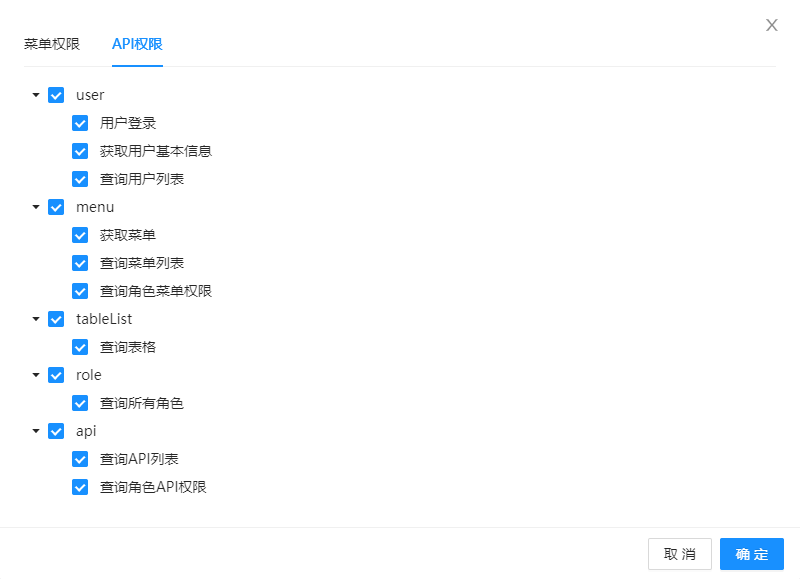

# Vite+Vue3+TS 项目配置

## 创建 Vite 项目

首先，通过模板创建项目：

```sh
yarn create vite project-name
# 或 npm create vite@latest project-name
```

选择 vue 框架以及 vue-ts 的版本。

接着安装依赖：

```sh
yarn
# 或 npm install
```

然后运行项目：

```sh
yarn dev
# 或 npm run dev
```

## Volar 语法提示插件

推荐在 VS Code 中安装 Volar 扩展，Volar 为 Vue3 和 TS 提供了更加友好的语法提示。


> 安装 Volar 需要先关闭 Vetur 并重启 IDE。

## ESLint

略。

## Prettier

### VS Code 安装扩展

VS Code 搜索并安装 Prettier 扩展：


修改 `settings.json` 配置文件：

```json
{
  "editor.defaultFormatter": "esbenp.prettier-vscode", // 设为默认格式化插件
  "editor.formatOnSave": true // 保存文件时自动格式化代码
}
```

> 如果 VS Code 对某些文件启用了其他特定的格式化插件，需要取消对应的配置，或者手动改为 `"esbenp.prettier-vscode"` 。

```diff
  {
-   "[vue]": {
-     "editor.defaultFormatter": "johnsoncodehk.volar"
-   }
  }
```

然后配置 Prettier 规则：可以打开 `Preferences -> Settings` ，搜索 prettier 进行配置，或者参考 [Prettier 配置](https://www.prettier.cn/docs/options.html#prose-wrap) ，修改 `settings.json` ：

```json
{
  "prettier.semi": false,
  "prettier.singleQuote": true,
  "prettier.trailingComma": "none"
}
```

### 项目配置

团队开发中，为了对项目代码进行统一格式化，需要在项目中另外引入 Prettier ：

```sh
yarn add prettier -D
```

创建 `prettierignore` ，配置忽略代码格式化的目录和文件：

```
node_modules
dist
```

创建 `.prettierrc.js`：

```js
module.exports = {
  tabWidth: 2,
  singleQuote: true,
  semi: true,
  trailingComma: 'none'
};
```

Prettier 格式化代码时，如果发现项目根目录有配置文件，则会优先使用配置文件的规则，这样就可以对代码统一格式化。

## 类型声明文件

新建 `types` 文件夹，用于统一存放项目中的类型声明文件，我们把默认生成的 `src/env.d.ts` 文件也放到这个文件夹中统一管理。然后修改 `tsconfig.json` ，增加 TS 编译目录和类型声明目录：

```diff
  {
    "compilerOptions": {
+     "typeRoots": ["./node_modules/@types/", "./types"]
    },
    "include": [
      "src/**/*.ts",
      "src/**/*.d.ts",
      "src/**/*.tsx",
      "src/**/*.vue",
+     "types/**/*.d.ts"
    ]
  }
```

## setup 语法糖自动导入 API

如果项目使用 `setup` 语法糖，则可以通过 `unplugin-auto-import` 插件自动化导入相关的 API。

安装插件：

```sh
yarn add unplugin-auto-import -D
# 或 npm install unplugin-auto-import -D
```

修改 `vite.config.js` 配置文件：

```diff
  import { defineConfig } from 'vite';
  import vue from '@vitejs/plugin-vue';
+ import AutoImport from 'unplugin-auto-import/vite';

  export default defineConfig({
    plugins: [
      vue(),
+     AutoImport({
+       imports: ['vue'],
+       dts: 'types/auto-imports.d.ts'
+     })
+   ]
  });
```

```diff
  <script setup lang="ts">
- import { ref } = 'vue'; // 不再需要手动导入相关的 API
  const count = ref(0);
  </script>
```

## 配置路径别名

首先需要安装 `@types/node` 来识别 node 模块：

```sh
yarn add @types/node -D
```

然后修改 `vite.config.js`：

```diff
  import { defineConfig } from 'vite';
+ import * as path from 'path';

  export default defineConfig({
+   resolve: {
+     alias: {
+       '@': path.resolve(__dirname, 'src')
+     }
+   }
  });
```

还需要修改 `tsconfig.json` ，为 TS 设置模块名-路径映射，否则以别名开头的模块无法被 TS 识别：

```json
{
  "compilerOptions": {
    "paths": {
      "@/*": ["./src/*"]
    }
  }
}
```

除此之外，建议 VS Code 安装 Path Autocomplete 这个扩展，可以添加路径提示，同时可以修改 `settings.json` ，为路径别名添加路径提示：

```json
{
  "path-autocomplete.pathMappings": {
    "@": "${folder}/src/"
  }
}
```

## CSS 预处理器

Vite 内置了对 `.scss`, `.sass`, `.less`, `.styl` 和 `.stylus` 文件的支持，只需要安装预处理依赖即可：

```sh
yarn add less -D
```

## Ant Design Vue 组件库

Ant Design Vue 的用法参考：[Ant Design Vue 官方文档](https://2x.antdv.com/docs/vue/introduce-cn)

首先安装组件库：

```sh
yarn add ant-design-vue@next
```

为了实现按需导入，需要安装 `unplugin-vue-components` 插件：

```sh
yarn add unplugin-vue-components -D
```

然后修改 `vite.config.js` ：

```diff
  import { defineConfig } from 'vite';
+ import Components from 'unplugin-vue-components/vite';
+ import { AntDesignVueResolver } from 'unplugin-vue-components/resolvers';

  export default defineConfig({
    plugins: [
+     Components({
+       resolvers: [AntDesignVueResolver()]
+     })
    ]
  });
```

## Vue Router

首先安装 `vue-router`：

```sh
yarn add vue-router
```

然后定义路由表：

```typescript
// src/router/index.ts
import { createRouter, createWebHistory, RouteRecordRaw } from 'vue-router';
import Home from '@/components/Home.vue';

const routes: RouteRecordRaw[] = [
  {
    path: '/',
    component: Home
  }
];

const router = createRouter({
  history: createWebHistory(''),
  routes
});

export default router;
```

使用 `<router-view>` ：

```vue
<!-- src/App.vue -->
<template>
  <router-view></router-view>
</template>
```

引入路由：

```diff
  // src/main.ts
  import { createApp } from 'vue';
  import App from './App.vue';
+ import router from './router';

- createApp(App).mount('#app');
+ const app = createApp(App);

+ app.use(router).mount('#app');
```

NProgress 插件显示页面加载进度条：

```sh
yarn add nprogress
yarn add -D @types/nprogress
```

```diff
  // src/router/index.ts
  import { createRouter, createWebHistory, RouteRecordRaw } from 'vue-router';
  import Home from '@/components/Home.vue';
+ import NProgress from 'nprogress';
+ import 'nprogress/nprogress.css';

  const routes: RouteRecordRaw[] = [
    {
      path: '/',
      component: Home
    }
  ];

  const router = createRouter({
    history: createWebHistory(''),
    routes
  });

+ router.beforeEach(() => {
+   NProgress.start();
+ });

+ router.afterEach(() => {
+   NProgress.done();
+ });

  export default router;
```

## 封装请求

### 安装

首先，安装 axios：

```sh
yarn add axios
```

### 基本封装

创建 `src/utils/http.ts` 文件，用于实现封装 axios：

```typescript
import axios, { AxiosInstance } from 'axios';

class Request {
  private _http: AxiosInstance;
  private static _instance: Request | undefined;

  constructor() {
    this._http = axios.create({
      baseURL: '',
      timeout: 10000
    });
  }

  // 返回单例
  public static getInstance(): Request {
    this._instance || (this._instance = new Request());
    return this._instance;
  }
}

export default Request.getInstance();
```

定义一个 `Request` 类，实现请求的相关业务，首先定义一个 axios 的实例 `_http` ，在构造函数中通过 `axios.create()` 进行创建，然后通过 `getInstance()` 方法返回单例并从模块导出。

### 请求拦截和响应拦截

有些时候，我们需要对请求进行统一配置，例如：

- 请求拦截：在请求头中统一添加鉴权 `token` ，显示全局 loading 等
- 响应拦截：对接口错误信息统一进行显示（Notification，Message 之类的组件），隐藏全局 loading 等

```diff
  import axios, {
    AxiosInstance,
+   AxiosRequestConfig,
+   AxiosRequestHeaders,
+   AxiosResponse
  } from 'axios';
+ import { notification } from 'ant-design-vue';
+ import 'ant-design-vue/es/notification/style/css';

+ // 约束响应数据
+ type BaseResponse<T> = {
+   code: number;
+   data: T;
+   message: string;
+ };

  class Request {
    private _http: AxiosInstance;
    private static _instance: Request | undefined;

    constructor() {
      this._http = axios.create({
        baseURL: '',
        timeout: 10000
      });
+     this.setRequestInterceptors();
+     this.setResponseInterceptors();
    }

    // 返回单例
    public static getInstance(): Request {
      this._instance || (this._instance = new Request());
      return this._instance;
    }

+   // 请求拦截
+   private setRequestInterceptors() {
+     this._http.interceptors.request.use(
+       (config: AxiosRequestConfig) => config,
+       (error: any) => Promise.reject(error)
+     );
+   }

+   // 响应拦截
+   private setResponseInterceptors() {
+     this._http.interceptors.response.use(
+       <T>(response: AxiosResponse): Promise<T> => {
+         const { code, data, message }: BaseResponse<T> = response.data;
+         if (code === 0) {
+           return Promise.resolve(data);
+         }
+         notification.error({
+           message: code + '',
+           description: message
+         });
+         return Promise.reject(message);
+       },
+       (error: any) => {
+         notification.error({
+           message: '请求失败',
+           description: error.message
+         });
+         return Promise.reject(error);
+       }
+     );
+   }
  }

  export default Request.getInstance();
```

在构造函数中为 `_http` 实例设置请求拦截和响应拦截。

响应拦截：对于响应数据，我们约定 `response.data` 需要包含 `code`、`data` 和 `message` 三个字段，于是定义类型 `BaseResponse` 进行约束，为了进一步约束 `data` 的类型，我们指定了泛型 `<T>`。当 `code = 0` 时，表示请求正常（具体值看后端接口的约定）， 返回 `data`；当接口请求失败时，通过 `notification` 组件弹出提示。

### 封装 GET 请求和 POST 请求

为了方便调用，我们进一步封装 GET 请求（其他请求方式同理）：

```diff
  import axios, {
    AxiosInstance,
    AxiosRequestConfig,
    AxiosRequestHeaders,
    AxiosResponse
  } from 'axios';
  import { notification } from 'ant-design-vue';
  import 'ant-design-vue/es/notification/style/css';

  // 约束响应数据
  type BaseResponse<T> = {
    code: number;
    data: T;
    message: string;
  };

  class Request {
    private _http: AxiosInstance;
    private static _instance: Request | undefined;

    constructor() {
      this._http = axios.create({
        baseURL: '',
        timeout: 10000
      });
      this.setRequestInterceptors();
      this.setResponseInterceptors();
    }

    // ...

+   // 封装GET请求
+   public get<T>(url: string, config: AxiosRequestConfig = {}): Promise<T> {
+     return this._http.get(url, config);
+   }

+   // 封装POST请求
+   public post<T>(
+     url: string,
+     data?: any,
+     config: AxiosRequestConfig = {}
+   ): Promise<T> {
+     return this._http.post(url, data, config);
+   }
  }

  export default Request.getInstance();
```

上一步响应拦截中，请求会返回一个 `Promise` 对象，我们通过泛型 `<T>` 约束数据的类型。

### 封装 API

首先创建 `types/user.d.ts` ，用于定义数据类型：

```typescript
declare type UserInfo = {
  username: string;
  avatar: string;
};
```

然后创建 `src/api/index.ts` ，用于封装接口，对于不同模块的接口，建议分别创建单独的文件进行管理。

```typescript
import http from '@/utils/http';

// 获取用户基本信息
export const getUserInfo = () => http.get<UserInfo>('/api/userInfo');
```

## Mock

### 安装依赖

首先安装 Mock.js：

```sh
yarn add mockjs
```

然后安装 `vite-plugin-mock` ，该插件为 Vite 提供了本地 mocks 服务：

```sh
yarn add vite-plugin-mock -D
```

### 引入插件

```diff
  import { defineConfig } from 'vite';
+ import { viteMockServe } from 'vite-plugin-mock';

  export default defineConfig({
    plugins: [
+     viteMockServe()
    ]
  });
```

`vite-plugin-mock` 插件的详细配置参考：[Github: vite-plugin-mock](https://github.com/vbenjs/vite-plugin-mock)

### 添加 Mock 文件

新建 `mock` 文件夹（ `vite-plugin-mock` 插件默认路径），并创建 `index.ts` 文件，对于不同模块的请求，建议分别创建单独的文件进行管理。

```typescript
// src/mock/index.ts
import { MockMethod, Recordable } from 'vite-plugin-mock';
import Mock, { Random } from 'mockjs';

declare type RequestOptions = {
  url: Recordable;
  body: Recordable;
  query: Recordable;
  headers: Recordable;
};

const mockServices: MockMethod[] = [
  {
    url: '/api/userInfo',
    method: 'get',
    timeout: 500,
    response: ({ url, body, query, headers }: RequestOptions) => {
      return {
        code: 0,
        data: {
          username: Mock.mock('@cname'),
          avatar: Random.image('100x100', '#aaa', '#f00', 'a')
        }
        message: 'success'
      };
    }
  }
];

export default mockServices;
```

更多 Mock.js 的用法参考：[Mock.js 示例](http://mockjs.com/examples.html) 。

### 添加 TS 编译目录

```diff
  {
    "include": [
      "src/**/*.ts",
      "src/**/*.d.ts",
      "src/**/*.tsx",
      "src/**/*.vue",
      "types/**/*.d.ts",
+     "mock/**/*.ts"
    ]
  }
```

## Pinia

[Pinia](https://pinia.vuejs.org/introduction.html) 是 Vue 官方团队开发的 Vue 状态管理的解决方案，Pinia 实现了 Vuex 5 的许多提案，是下一代的 Vuex。

Pinia 相比于 Vuex 3/4，具有以下特点：

- 去除了 `mutations` ，不再需要通过 `mutations` 这种冗长的方式修改状态。
- 更好地 TypeScript 支持。
- 无需手动添加 store，store 创建后会自动添加。
- 扁平化设计，无嵌套模块，也不需要命名空间，store 之间可以交叉组合使用。

### 安装

```sh
yarn add pinia
```

### 创建和挂载实例

```diff
  // src/main.ts
  import { createApp } from 'vue';
  import App from './App.vue';
  import router from './router';
+ import { createPinia } from 'pinia';

  const app = createApp(App);

- app.use(router).mount('#app');
+ app.use(router).use(createPinia()).mount('#app');
```

### 创建 store

```ts
// store/countStore.ts
import { defineStore } from 'pinia';

type CountState = {
  count: number;
};

export const useCountStore = defineStore('count', {
  state: (): CountState => {
    return {
      count: 0
    };
  },
  actions: {
    increase(value: number) {
      this.count += value;
    }
  }
});
```

- `defineStore` 函数第一个参数表示 store 的名称，这个值需要唯一。
- `state` 和 Vue 2 组件中 `data` 选项的声明差不多，一个函数，返回一个对象，对象的属性就是响应式的数据。值得注意的是，`state` 采用箭头函数，这是为了保证服务端渲染也能正常使用。
- `actions` 和 Vue 2 组件中 `methods` 选项差不多，定义方法，方法内部通过 `this` 访问数据。

### 使用 store

```vue
<template>
  <!-- <div>{{ countStore.count }}</div> -->
  <div>{{ count }}</div>
  <button @click="onPlus">+1</button>
</template>

<script setup lang="ts">
import { useCountStore } from '@/store/countStore';
import { storeToRefs } from 'pinia';

const countStore = useCountStore();
const { count } = storeToRefs(countStore);

const onPlus = () => {
  // countStore.count++
  // count.value++
  countStore.increase(1);
};
</script>
```

和 Vue 3 中 `toRefs()` 方法类似，Pinia 提供了 `storeToRefs()` 方法，用于对 store 进行解构。

状态值可以直接在组件中修改，但是建议通过 `actions` 封装方法，避免数据混乱，难以维护。

## 登录拦截

### 实现原理

1. 路由拦截，每次访问页面前，先检查本地是否有 token，如果没有，则跳转到登录页，执行第 2 步；如果有，执行第 3 步
2. 用户使用账号密码登录后，获取 token，将 token 缓存到本地
3. 所有（需要鉴权）的接口访问时，都要在请求头中携带 token
4. 携带 token 请求数据，如果返回 401 未授权，说明 token 过期，需要跳转到登录页，执行第 2 步

### 实现过程

1. 类型定义

类型定义，包含：

- `Account` ：登录帐号数据格式
- `Token` ：登录后获取到的数据格式
- `UserInfo` ：用户基本信息数据格式

```typescript
// types/login.ts
declare type Account = {
  account: string;
  password: string;
};

declare type Token = {
  token: string;
};

declare type UserInfo = {
  username: string;
  avatar: string;
};
```

2. 定义登录接口

```typescript
// src/api/login.ts
import http from '@/utils/http';

// 登录
export const login = (account: Account) =>
  http.post<Token>('/api/login', account);

// 获取用户基本信息
export const getUserInfo = () => http.get<UserInfo>('/api/userInfo');
```

3. 封装登录 store

```typescript
// src/store/loginStore.ts
import { defineStore } from 'pinia';
import { login, getUserInfo } from '@/api/login';

type LoginState = {
  info: UserInfo | null; // 用户基本信息，用于判断是否登录
};

export const useLoginStore = defineStore('login', {
  state: (): LoginState => {
    return {
      info: null
    };
  },
  actions: {
    // 封装登录接口
    async login(account: Account) {
      try {
        const data = await login(account);
        // 缓存token
        localStorage.setItem('token', data.token);
      } catch (error) {
        return Promise.reject(error);
      }
    },
    // 获取用户基本信息
    async getUserInfo() {
      try {
        const data = await getUserInfo();
        this.info = data;
      } catch (error) {
        return Promise.reject(error);
      }
    },
    // 退出登录
    logout() {
      // TODO 退出登录接口（如果需要）
      // 移除token，清空个人信息
      localStorage.removeItem('token');
      this.info = null;
    }
  }
});
```

4. 路由拦截

```typescript
// src/router/index.ts
import NProgress from 'nprogress';
import 'nprogress/nprogress.css';
import { useLoginStore } from '@/store/loginStore';

// 免登录白名单
const whiteList = ['/login', '/404'];

// 路由守卫，登录拦截
router.beforeEach(async (to, from) => {
  NProgress.start();
  const token = localStorage.getItem('token');
  if (token) {
    // 有token
    const loginStore = useLoginStore();
    if (loginStore.info) {
      // 有用户信息，说明已登录
      if (to.path === '/login') {
        // 如果是登录页，则重定向到首页
        return '/';
      }
      return true;
    }
    // 有token，无用户信息（刷新页面）
    try {
      await loginStore.getUserInfo();
      return true;
    } catch (error) {
      loginStore.logout();
      return '/login';
    }
  } else {
    // 无token（未登录/退出登录）
    if (whiteList.includes(to.path)) {
      // 免登录白名单，正常访问（避免死循环）
      return true;
    }
    // 重定向到登录页
    return '/login';
  }
});

router.afterEach(() => {
  NProgress.done();
});
```

注意这里定义免登录白名单，防止登录页重定向到登录页，造成死循环。

Vue Router4 中，路由守卫是异步解析执行，此时导航在所有守卫 `resolve` 完之前一直处于**等待中**。

- 如果返回 `true` 或者 `undefined`（即不返回），则当前导航是有效的，相当于旧版 `next(true)` 和 `next()` ；
- 如果返回 `false`，则取消当前导航，相当于旧版 `next(false)`；
- 如果返回一个路由地址，则取消当前导航，并进行新的导航，相当于旧版 `next(RouteLocationRaw)` 。

路由守卫的更多用法参考：[导航守卫 | Vue Router](https://router.vuejs.org/zh/guide/advanced/navigation-guards.html) 。

5. 请求拦截

接口请求拦截，请求头添加 token，用于鉴权：

```diff
  // utils/http.ts
  import axios, {
    AxiosInstance,
    AxiosRequestConfig,
+   AxiosRequestHeaders,
    AxiosResponse
  } from 'axios';

  class Request {
	// ...

    // 请求拦截
    private setRequestInterceptors() {
      this._http.interceptors.request.use(
        (config: AxiosRequestConfig) => {
+         // 请求头添加Authorization
+         const token = localStorage.getItem('token');
+         if (token) {
+           (<AxiosRequestHeaders>(
+             config.headers
+           )).Authorization = `Bearer ${token}`;
+         }
          return config;
        },
        (error: any) => {
          return Promise.reject(error);
        }
      );
    }
  }
```

6. 响应拦截

接口响应拦截，当授权过期时，重定向到登录页：

```diff
  import axios, {
    AxiosInstance,
    AxiosRequestConfig,
    AxiosRequestHeaders,
    AxiosResponse
  } from 'axios';
  import { notification } from 'ant-design-vue';
  import 'ant-design-vue/es/notification/style/css';
+ import { useLoginStore } from '@/store/loginStore';

  class Request {
    // ...

    // 响应拦截
    private setResponseInterceptors() {
      this._http.interceptors.response.use(
        <T>(response: AxiosResponse): Promise<T> => {
          const { code, data, message }: BaseResponse<T> = response.data;
          if (code === 0) {
            return Promise.resolve(data);
          }
          notification.error({
            message: code + '',
            description: message
          });
+         if (code === 401) {
+           // 授权过期，退出登录，重定向到登录页
+           const loginStore = useLoginStore();
+           loginStore.logout();
+           window.location.reload();
+         }
          return Promise.reject(message);
        },
        (error: any) => {
          notification.error({
            message: '请求失败',
            description: error.message
          });
          return Promise.reject(error);
        }
      );
    }
  }
```

## 权限管理

权限管理基于**角色管理**，为不同的用户分配不同的角色，不同角色能够访问的页面（**路由权限**）和接口（**接口权限**）都是不同的。


### 路由权限/菜单管理及菜单栏

路由权限有两种实现方法，一种是前端配置，一种是后端配置，本项目采用后端配置路由表的方式。

#### 前端配置路由表

1. 后端应该提供 `roles[]` 字段，前端登录后可以获取到用户所属角色。
2. 前端实现通用路由表，这个路由表是静态的，包含不需要登录就可以访问的公共页面，例如：登录页、404 页面等。
3. 准备动态路由表，路由表通过 `meta.roles` 字段指定允许访问的角色。
4. 用户登录后，根据 `roles` 比对动态路由表，筛选出可以访问的动态路由表，通过 `router.addRoute()` 添加路由表。

#### 后端配置路由表

1. 前端实现通用路由表，这个路由表是静态的，包含不需要登录就可以访问的公共页面，例如：登录页、404 页面等。

2. 后台需要支持配置路由表，并且设置角色的路由权限：


3. 用户登录后，获取用户有权访问的（动态）路由表。

4. 通过 `router.addRoute()` 添加动态路由表。

5. 匹配其他路由，重定向到 404 页面。

**实现过程**

首先，准备通用路由表：

```typescript
// src/router/index.ts
import { createRouter, createWebHistory, RouteRecordRaw } from 'vue-router';
import LayoutMain from '@/layouts/LayoutMain.vue';

// 通用路由表
export const constantRoutes: RouteRecordRaw[] = [
  {
    path: '/',
    component: LayoutMain,
    name: 'home',
    redirect: '/welcome',
    meta: { title: '首页' },
    children: []
  },
  {
    path: '/login',
    component: () => import('@/views/Login.vue'),
    name: 'login',
    meta: { hidden: true }
  },
  {
    path: '/404',
    component: () => import('@/views/exception/404.vue'),
    meta: { hidden: true }
  }
];

const router = createRouter({
  history: createWebHistory(''),
  routes: constantRoutes
});
```

然后，创建一个 store，用来管理路由表：

```typescript
// src/store/routerStore.ts
import { defineStore } from 'pinia';
import { RouteRecordRaw } from 'vue-router';
import { constantRoutes } from '@/router/index';

type RouterStoreState = {
  routes: RouteRecordRaw[]; // 总路由表
  asyncRoutes: RouteRecordRaw[]; // 动态添加的路由表
};

export const useRouterStore = defineStore('router', {
  state: (): RouterStoreState => {
    return {
      routes: constantRoutes,
      asyncRoutes: []
    };
  },
  getters: {
    // 菜单栏渲染列表
    menus(): RouteRecordRaw[] {
      return this.routes[0].children || [];
    }
  },
  actions: {
    /**
     * @desc 递归生成动态路由表
     * @param menus 后端获取到的菜单列表
     */
    setAsyncRoutes(menus: MenuItem[]) {
      const modules = import.meta.glob('../**/*.vue');
      const routes: RouteRecordRaw[] = [];
      for (const item of menus) {
        const route: RouteRecordRaw = {
          path: item.path,
          component: markRaw(modules[`../${item.component}`]),
          meta: item.meta,
          redirect: item.redirect
        };
        if (item.children) {
          route.children = this.setAsyncRoutes(item.children);
        }
        routes.push(route);
      }
      return routes;
    },
    /**
     * @desc 生成动态路由表，并将动态路由表合并到总路由表
     * @param menus 后端获取到的菜单列表
     */
    generateRoutes(menus: MenuItem[]) {
      const asyncRoutes = [constantRoutes[0]];
      asyncRoutes[0].children = this.setAsyncRoutes(menus);
      this.asyncRoutes = asyncRoutes;
      this.routes.splice(0, 1, asyncRoutes[0]);
    }
  }
});
```

> 我们将动态路由表添加到 `'home'` 路由的 `children`中，这个子路由也会被作为菜单栏进行渲染。

然后，在路由守卫中，登录获取动态路由表/菜单列表，添加到路由中：

```diff
  // src/router/index.ts
+ import { useLoginStore } from '@/store/loginStore';
+ import { getUserMenu } from '@/api/login';

  // ...

  // 免登录白名单
  const whiteList = ['/login', '/404'];

+ // 获取用户路由表
+ const getRoutes = async () => {
+   const routerStore = useRouterStore();
+   const menus = await getUserMenu();
+   routerStore.generateRoutes(menus);
+   // 动态添加路由
+   if (routerStore.asyncRoutes[0]?.children) {
+     routerStore.asyncRoutes[0].children.forEach((route: RouteRecordRaw) => {
+       // 将动态路由表添加到 'home' 的子路由
+       router.addRoute('home', route);
+     });
+   }
+   // 匹配其他路由，重定向到404
+   router.addRoute({
+     path: '/:pathMatch(.*)*',
+     redirect: '/404'
+   });
+ };

  // 路由守卫，登录拦截
  router.beforeEach(async (to, from) => {
    NProgress.start();
    const token = localStorage.getItem('token');
    if (token) {
      // 有token
      const loginStore = useLoginStore();
      if (loginStore.info) {
        // 有用户信息，说明已登录
        if (to.path === '/login') {
          // 如果是登录页，则重定向到首页
          return '/';
        }
        return true;
      }
      // 有token，无用户信息（刷新页面）
      try {
        await loginStore.getUserInfo();
-       return true;
+       // 获取用户路由表
+       await getRoutes();
+       // 重定向到当前页面，避免路由未更新
+       return { ...to, replace: true };
      } catch (error) {
        loginStore.logout();
        return '/login';
      }
    } else {
      // 无token（未登录/退出登录）
      if (whiteList.includes(to.path)) {
        // 免登录白名单，正常访问（避免死循环）
        return true;
      }
      // 重定向到登录页
      return '/login';
    }
  });
```

**菜单栏的实现**

菜单栏基于路由权限（`routerStore.menus`），只有用户有权访问的页面，才会在侧边栏的菜单中出现。

菜单栏组件可以参考： [导航菜单 Menu - Ant Design Vue](https://www.antdv.com/components/menu-cn) 。

菜单栏一般不会显示整个路由表，而是选取 `'home'` 路由的 `children`。

菜单项由 `<router-link>` 构成，点击跳转到对应的页面，除此之外，还应该监听路由的变化，根据路由展开/高亮对应的菜单。

### 接口权限

一般地，如果用户没有权限访问某个接口，应当返回 403 状态码。为此，后台需要配置 API 列表，并且设置角色的接口权限。




## 打包分析

Vite 基于 Rollup 进行打包，因此，可以使用 Rollup Plugin Visualizer 插件进行打包分析。

```sh
yarn add -D rollup-plugin-visualizer
```

```typescript
// vite.config.ts
import { defineConfig } from 'vite';
import { visualizer } from 'rollup-plugin-visualizer';

// https://vitejs.dev/config/
export default defineConfig({
  plugins: [
    // 打包分析
    visualizer((options: any) => {
      return {
        template: 'sunburst',
        gzipSize: true
      };
    })
  ]
});
```

更多配置选项参考：[rollup-plugin-visualizer](https://github.com/btd/rollup-plugin-visualizer) 。

然后打包到生产环境：

```sh
yarn build
```

打包完成后会生成 `stats.html` 文件，打开后就是项目打包的可视化分析图。


